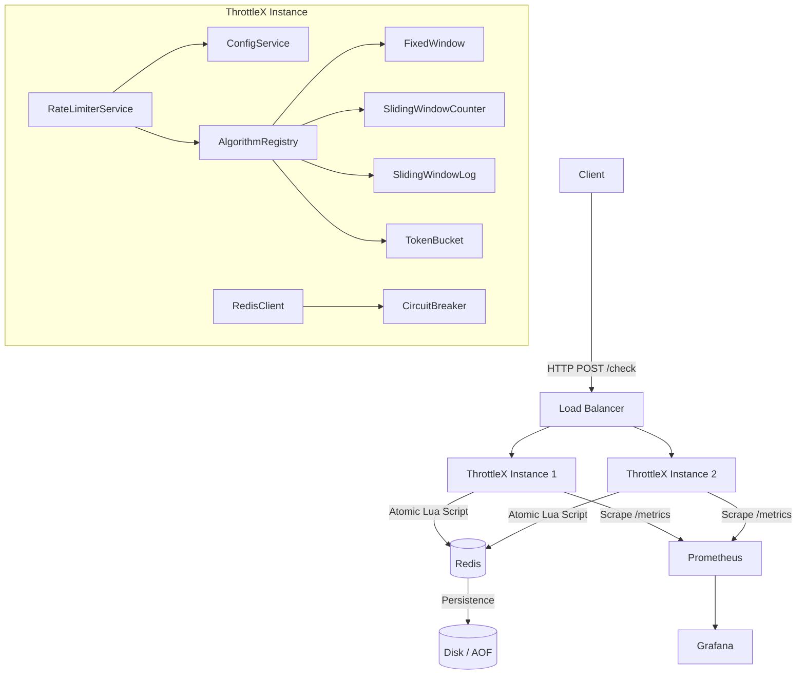

# ThrottleX — Distributed Rate Limiting Platform

A production-grade, horizontally scalable rate limiting service built with TypeScript, Node.js, Express, and Redis. Demonstrates distributed systems engineering: atomic operations, circuit breaking, observability, and fault tolerance.

---

## Architecture



---

## Rate Limiting Algorithms

| Algorithm | Memory | Accuracy | Burst Handling | Best For |
|---|---|---|---|---|
| **Fixed Window** | O(1) | Low (boundary spikes) | None | Simple counters |
| **Sliding Window Counter** | O(1) | High (interpolated) | Smooth | General-purpose API limits |
| **Sliding Window Log** | O(N) | Exact | None | Low-volume, high-accuracy |
| **Token Bucket** | O(1) | Exact | Yes (burst cap) | APIs with bursty traffic |

### Fixed Window
Divides time into discrete windows and counts requests per window.  
**Caveat:** allows a 2× burst at window boundaries.

### Sliding Window Counter
Interpolates the previous and current windows:  
`effective_count = prev_count × (1 − elapsed%) + curr_count`  
Eliminates boundary spikes at O(1) memory cost.

### Sliding Window Log
Stores each request's timestamp in a Redis sorted set.  Evicts entries older than the window on every check.  Most accurate but uses O(N) memory proportional to request rate.

### Token Bucket
Tokens refill at a constant rate up to `burstCapacity`.  Consumers are denied when empty.  Ideal for APIs that need to allow short bursts while enforcing a long-run average.

---

## Project Structure

```
throttlex/
├── src/
│   ├── algorithms/          # Rate-limiting algorithm implementations
│   │   ├── base.ts          # RateLimitAlgorithm interface
│   │   ├── fixedWindow.ts
│   │   ├── slidingWindowCounter.ts
│   │   ├── slidingWindowLog.ts
│   │   ├── tokenBucket.ts
│   │   └── index.ts         # Algorithm registry singleton
│   ├── config/
│   │   ├── index.ts         # Environment-driven configuration
│   │   └── logger.ts        # Winston structured JSON logger
│   ├── metrics/
│   │   └── index.ts         # Prometheus counters, histograms, gauges
│   ├── middleware/
│   │   ├── rateLimitMiddleware.ts  # Global IP-based middleware
│   │   └── requestLogger.ts        # Structured access logging
│   ├── redis/
│   │   ├── circuitBreaker.ts  # CLOSED / HALF_OPEN / OPEN state machine
│   │   ├── client.ts          # ioredis wrapper with retry + circuit breaker
│   │   └── luaScripts.ts      # Atomic Lua scripts for each algorithm
│   ├── routes/
│   │   ├── check.ts    # POST /check
│   │   ├── config.ts   # CRUD /config
│   │   ├── health.ts   # GET /health, GET /ready
│   │   └── metrics.ts  # GET /metrics (Prometheus)
│   ├── services/
│   │   ├── configService.ts      # Config CRUD + local LRU cache
│   │   └── rateLimiterService.ts # Orchestrates algorithm + config + metrics
│   ├── types/
│   │   └── index.ts    # Shared TypeScript interfaces
│   ├── app.ts          # Express application factory
│   └── server.ts       # Entry point + graceful shutdown
├── tests/
│   ├── unit/
│   │   ├── algorithms/   # Isolated algorithm tests with mocked Redis
│   │   └── services/     # ConfigService unit tests
│   ├── integration/
│   │   └── rateLimiter.test.ts  # Full HTTP API integration tests
│   └── load/
│       └── k6-script.js         # k6 load test (steady + spike + concurrency)
├── prometheus/
│   └── prometheus.yml
├── grafana/
│   └── dashboard.json   # Pre-built Grafana dashboard
├── Dockerfile
└── docker-compose.yml
```

---

## API Reference

### POST /check

Evaluate whether a request should be allowed.

**Request**
```json
{
  "key": "user:alice",
  "endpoint": "/api/v1/payments",
  "tokens": 1
}
```

| Field | Type | Required | Description |
|---|---|---|---|
| `key` | string | ✓ | Rate-limit identifier (user ID, API key, IP, …) |
| `endpoint` | string | – | Optional path for per-endpoint limits |
| `tokens` | integer | – | Tokens to consume (token-bucket only, default 1) |

**Response — allowed**
```json
{
  "allowed": true,
  "remaining": 98,
  "resetAt": 1710000060,
  "limit": 100
}
```

**Response — rate limited (429)**
```json
{
  "allowed": false,
  "remaining": 0,
  "resetAt": 1710000060,
  "limit": 100,
  "retryAfter": 42
}
```

**Headers always present**
```
X-RateLimit-Limit:     100
X-RateLimit-Remaining: 98
X-RateLimit-Reset:     1710000060
Retry-After:           42        (only on 429)
X-Request-Id:          <uuid>
```

---

### POST /config

Create or replace a rate-limit configuration.

```json
{
  "key": "user:alice",
  "algorithm": "sliding-window-counter",
  "limit": 100,
  "windowMs": 60000,
  "scope": "user",
  "description": "Standard user limit"
}
```

Returns `201` with the created config.

**Config priority lookup** (most → least specific):
1. `{key}:{endpoint}`
2. `{key}`
3. `default:{endpoint}`
4. `default`

### GET /config/:key
Returns the stored config or `404`.

### PATCH /config/:key
Partial update — only provided fields are changed.

### DELETE /config/:key
Removes the config. Returns `204` or `404`.

### GET /configs
Returns all stored configs.

---

### GET /health

```json
{
  "status": "healthy",
  "redis": "connected",
  "circuitBreakerState": "CLOSED",
  "uptime": 3600,
  "timestamp": "2024-03-10T12:00:00.000Z",
  "version": "1.0.0"
}
```

| `status` | Meaning |
|---|---|
| `healthy` | All systems nominal |
| `degraded` | Circuit breaker open; operating in fallback mode |
| `unhealthy` | Redis unreachable; returns HTTP 503 |

### GET /ready
Kubernetes readiness probe — returns `200` when Redis is healthy, `503` otherwise.

### GET /metrics
Prometheus text-format metrics.

---

## Algorithms — Supported `algorithm` values

| Value | Description |
|---|---|
| `fixed-window` | Simple per-window counter |
| `sliding-window-counter` | Interpolated two-window counter |
| `sliding-window-log` | Sorted-set log of timestamps |
| `token-bucket` | Continuously refilling token bucket |

---

## Getting Started

### Prerequisites

- Node.js 20+
- Docker + Docker Compose
- Redis 7+ (or use the Docker Compose setup)

### Local Development

```bash
# 1. Install dependencies
npm install

# 2. Copy environment file
cp .env.example .env

# 3. Start Redis (Docker)
docker run -d -p 6379:6379 redis:7-alpine

# 4. Start the service
npm run dev
```

The service is now available at `http://localhost:3000`.

### Docker Compose (full stack)

```bash
docker compose up --build
```

| Service | URL |
|---|---|
| ThrottleX API | http://localhost:3000 |
| Prometheus | http://localhost:9090 |
| Grafana | http://localhost:3001 (admin / throttlex) |

---

## Testing

```bash
# All tests
npm test

# Unit tests only
npm run test:unit

# Integration tests only
npm run test:integration

# Coverage report
npm run test:coverage
```

### Load Testing (k6)

```bash
# Install k6: https://k6.io/docs/getting-started/installation/
k6 run tests/load/k6-script.js

# Against a remote host
k6 run --env BASE_URL=http://your-host:3000 tests/load/k6-script.js
```

The k6 script runs three scenarios:
- **Steady load** — 200 req/s for 30 s
- **Spike** — ramp to 2 000 req/s then recover
- **Concurrency** — 100 simultaneous VUs

---

## Configuration Reference

| Env Variable | Default | Description |
|---|---|---|
| `PORT` | `3000` | HTTP listen port |
| `REDIS_HOST` | `localhost` | Redis hostname |
| `REDIS_PORT` | `6379` | Redis port |
| `REDIS_PASSWORD` | – | Redis password (optional) |
| `REDIS_CONNECT_TIMEOUT` | `5000` | Connection timeout (ms) |
| `REDIS_COMMAND_TIMEOUT` | `2000` | Command timeout (ms) |
| `DEFAULT_ALGORITHM` | `sliding-window-counter` | Fallback algorithm |
| `DEFAULT_LIMIT` | `100` | Fallback request limit |
| `DEFAULT_WINDOW_MS` | `60000` | Fallback window (ms) |
| `FALLBACK_ALLOWED` | `true` | Allow/deny when Redis is down |
| `CB_FAILURE_THRESHOLD` | `5` | Failures before opening circuit |
| `CB_SUCCESS_THRESHOLD` | `2` | Successes before closing circuit |
| `CB_TIMEOUT` | `30000` | OPEN → HALF_OPEN delay (ms) |
| `LOG_LEVEL` | `info` | Winston log level |

---

## Observability

### Prometheus Metrics

| Metric | Type | Description |
|---|---|---|
| `throttlex_requests_total` | Counter | All check requests; labels: `algorithm`, `allowed`, `scope` |
| `throttlex_allowed_requests_total` | Counter | Allowed requests |
| `throttlex_rejected_requests_total` | Counter | Rejected (rate-limited) requests |
| `throttlex_redis_operation_duration_seconds` | Histogram | Lua script execution time |
| `throttlex_request_duration_seconds` | Histogram | End-to-end HTTP latency |
| `throttlex_active_keys` | Gauge | Active rate-limit key count |
| `throttlex_circuit_breaker_state` | Gauge | 0=CLOSED, 1=HALF_OPEN, 2=OPEN |

Plus all default Node.js process metrics (`process_cpu_*`, `process_resident_memory_bytes`, etc.).

### Grafana Dashboard

Import `grafana/dashboard.json` into Grafana or use the Docker Compose setup which mounts it automatically.

Panels included:
- Request throughput (allowed vs rejected)
- Request latency percentiles (p50/p95/p99)
- Redis Lua operation latency per algorithm
- Circuit breaker state
- Active key count
- Process memory

### Structured Logging

All logs are emitted as JSON in production:

```json
{
  "level": "info",
  "message": "rate_limit_decision",
  "service": "throttlex",
  "requestId": "3b4c5d6e-...",
  "key": "user:alice",
  "endpoint": "/api/v1/payments",
  "allowed": true,
  "remaining": 97,
  "timestamp": "2024-03-10T12:00:01.000Z"
}
```

---

## Design Decisions & Trade-offs

### Why Redis for shared state?
All application instances share rate-limit counters through Redis. Every counter mutation uses a Lua script executed atomically server-side — this eliminates TOCTOU (Time-of-Check / Time-of-Use) race conditions that would occur with a naïve GET → SET pattern.

### Lua scripts vs. Redis transactions (MULTI/EXEC)
MULTI/EXEC is optimistic: it retries the whole transaction on key conflicts. Lua scripts are executed in a single step with no retry overhead, making them faster and simpler for rate-limiting patterns that only update a small number of keys.

### Circuit Breaker (fail-open by default)
`FALLBACK_ALLOWED=true` means the service **allows** traffic when Redis is unreachable. This is the right default for most APIs where a brief allowance of extra traffic is preferable to a hard outage. Change to `false` if strict enforcement is required.

### In-process config cache (30 s TTL)
Each instance caches configs locally for 30 seconds. This reduces Redis load by orders of magnitude on read-heavy workloads. Config writes immediately invalidate the local cache entry so new configs take effect within 30 s worst-case, without a restart.

### Sliding Window Counter vs. Sliding Window Log
The counter approach uses O(1) memory regardless of traffic but is an approximation. The log approach is exact but uses O(N) memory (N = requests in the window). For high-throughput endpoints the counter is the right default; use the log only when you need sub-request-granularity accuracy.

---

## Distributed Systems Concepts Demonstrated

| Concept | Where |
|---|---|
| **Atomic Operations** | Lua scripts in `src/redis/luaScripts.ts` |
| **Distributed Coordination** | Shared Redis state across multiple app replicas |
| **Concurrency Control** | Lua script atomicity eliminates race conditions |
| **Circuit Breaker** | `src/redis/circuitBreaker.ts` (CLOSED/HALF_OPEN/OPEN) |
| **Fault Tolerance** | Configurable fail-open / fail-closed fallback |
| **Graceful Degradation** | Service remains functional when Redis is down |
| **Horizontal Scaling** | Stateless app; `docker-compose.yml` runs 2 replicas |
| **Observability** | Prometheus metrics + Grafana dashboard |
| **Performance Optimization** | In-process config cache, connection pooling |
| **High Availability** | Redis AOF persistence, health/readiness probes |

---

## Performance Benchmarks

Indicative numbers on a 2-core / 4 GB machine (single Redis, 2 app replicas):

| Algorithm | p50 | p95 | p99 | Throughput |
|---|---|---|---|---|
| Fixed Window | ~1 ms | ~3 ms | ~8 ms | ~18 000 req/s |
| Sliding Window Counter | ~1 ms | ~3 ms | ~9 ms | ~16 000 req/s |
| Sliding Window Log | ~2 ms | ~5 ms | ~12 ms | ~10 000 req/s |
| Token Bucket | ~1 ms | ~3 ms | ~8 ms | ~17 000 req/s |

Run the k6 load test against your own infrastructure for accurate numbers.

---

## License

MIT
